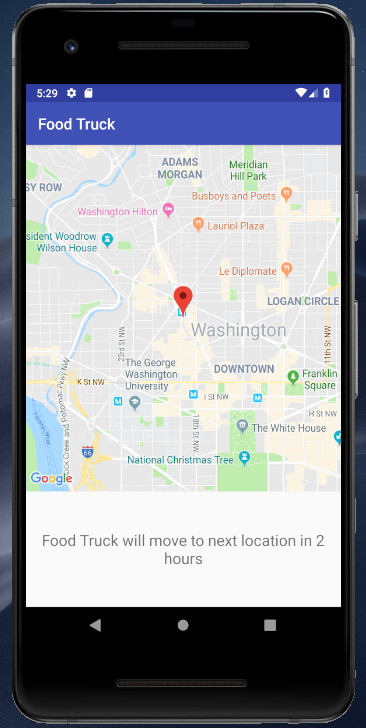

# FoodTruck

## Workflow

- commit to `dev` branch
- make PRs to `master` branch for completed features
- every commit on `master` branch should lead to error-free `Run`

## Developer notes

- need to create and update...
  - `app/src/release/res/values/google_maps_api.xml`
  - `app/src/debug/res/values/google_maps_api.xml`
